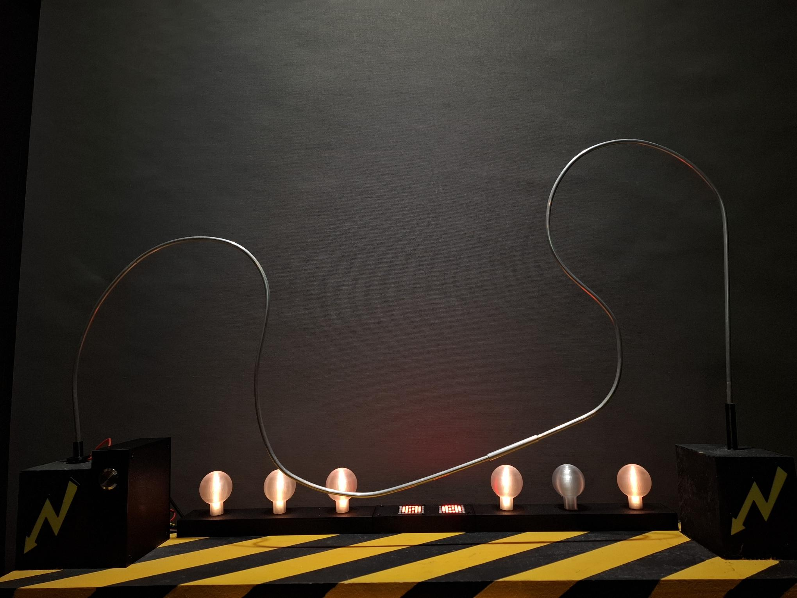

## HotWire Game – Geschicklichkeitsspiel

Ein Arduino-basiertes Reaktionsspiel mit NeoPixel-LEDs, MAX7219-Matrix und Buzzer.  
Der Spieler führt eine Metallschlaufe über einen Draht. Jede Berührung kostet ein Leben.  
Ein Countdown und visuelle Effekte erhöhen die Spannung.

---

## Funktionen
- 30‑Sekunden‑Modus oder 60‑Sekunden‑Modus
- Lebensanzeige über 6 NeoPixel-LEDs
- Große zweistellige Anzeige über MAX7219
- Akustische Signale
- Zufällige LED-Muster im Standby
- Musik am Spielende

---

## Hardware
- Arduino (Uno/Nano/Pro Mini)
- MAX7219 LED-Matrix (2 Module, FC16)
- NeoPixel LED-Streifen (6 LEDs)
- Buzzer
- Start-Taster
- Kontakt-Taster (Drahtberührung)
- Diverse Kabel, Stromversorgung

## Pinbelegung
| Komponente | Pin |
|-----------|-----|
| NeoPixel Data | D2 |
| Buzzer | D3 |
| Start Button | D4 |
| Contact Button | D5 |
| MAX7219 CS | D10 |
| MAX7219 Data | D11 |
| MAX7219 Clock | D13 |

## Bibliotheken
| Library | Autor | Lizenz |
|--------|--------|--------|
| Adafruit NeoPixel | Adafruit | LGPL-3.0 |
| MD_MAX72XX | MajicDesigns | LGPL-2.1 |
| Arduino Tone / tone() | Arduino Core | LGPL-2.1 |
| pitches.h | Arduino Beispielcode | Public Domain |
| Eigene Dateien (definitions.h etc.) | Frank | MIT |

Die vollständigen Lizenztexte findest du im Ordner **third_party_licenses/**.

---

## Lizenz
Dieses Projekt ist unter der MIT-Lizenz veröffentlicht.  
Drittanbieter-Lizenzen befinden sich im Ordner `third_party_licenses/`.

-----------------------------------------------------------------------------------------------------

# HotWire Game – Arduino Skill & Reaction Game

HotWire is a classic wire-loop skill game implemented with Arduino, NeoPixel LEDs, a MAX7219 LED matrix, and a buzzer.  
The player must guide a metal loop along a bent wire without touching it. Each contact reduces one life.  
A countdown timer, sound effects, and LED animations make the game fun and challenging.

---

## Features
- Two game modes:
  - **Normal Mode:** 30 seconds
  - **Extended Mode:** 60 seconds
- **6 life points** displayed via NeoPixel LEDs
- **Large two‑digit display** using MAX7219 LED matrices
- **Sound feedback** for countdown, hits, and game over
- **Random LED animations** in standby mode
- **End‑game melody** and color wipe effects

---

## Hardware Requirements
- Arduino Uno, Nano, or compatible board  
- MAX7219 LED matrix (2 modules, FC16 hardware type)  
- NeoPixel LED strip (6 LEDs)  
- Buzzer  
- Start button  
- Contact button (wire loop sensor)  
- Power supply and wiring  

---

## Pin Configuration

| Component        | Arduino Pin |
|------------------|-------------|
| NeoPixel Data    | D2          |
| Buzzer           | D3          |
| Start Button     | D4          |
| Contact Button   | D5          |
| MAX7219 CS       | D10         |
| MAX7219 Data     | D11         |
| MAX7219 Clock    | D13         |

---

## Libraries Used

| Library | Author | License |
|--------|--------|---------|
| **Adafruit NeoPixel** | Adafruit | LGPL‑3.0 |
| **MD_MAX72XX** | MajicDesigns | LGPL‑2.1 |
| **Arduino Core (tone)** | Arduino | LGPL‑2.1 |
| **pitches.h** | Arduino Examples | Public Domain |
| **Project code** | Frank | MIT License |

All third‑party license notices are included in the folder  
`third_party_licenses/`.

---

## License
This project is released under the MIT license.  
Third-party licenses are located in the `third_party_licenses/` folder.

---

